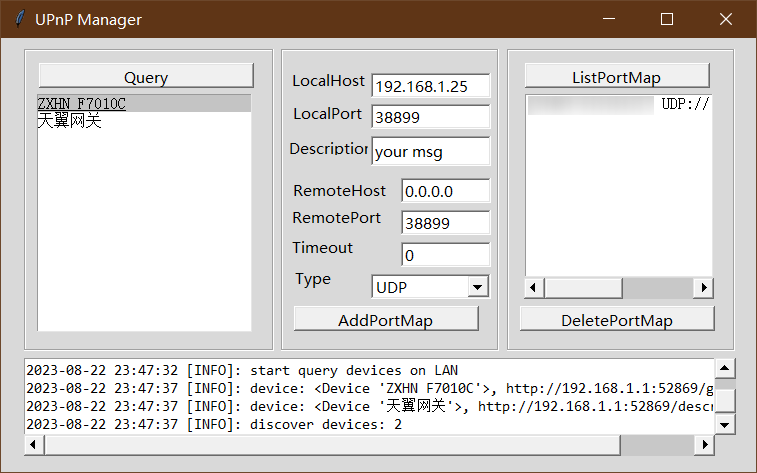

[TOC]

# UpnpTool

Upnp Manage Tool for local home network

## Features

1. Query UPnP Root Server.
2. List/Add/Delete NAT(port map) control over UPnP .

## Snapshot

Writen by Python 3.10

## Development

1. UI code Generator: use the software [PAGE - Python Automatic GUI Generator ](https://page.sourceforge.net/) to create and edit WinForm style window, and generate `<name>.py, <name>_support.py`.
2. Binary Pack: use pyinstaller to build distributed executable files. we could just click `make.bat` to build project.

